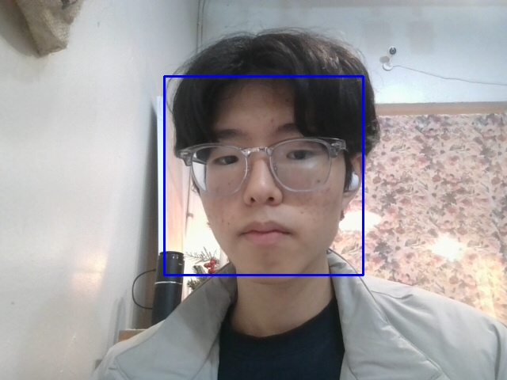

# Project outline

This project is an open-source software that uses Python and OpenCV to detect a person's face and mosaic the face part. We tried to create a program that mosaic pictures by looking at the mosaic pictures attached to the wall of the dormitory, and it combines privacy protection and image processing technology by recording videos and taking pictures of people.

## 조 구성

* 202334425 김대원: take the picture, fice-mosaic.py, managing repository
* 202334511 이우정: mosaic pic.py
* 202334514 이은주: video.py
* 202334496 유진규: person detection

## 사용한 패키지 및 버전

- Python (버전: 3..8.6)
- OpenCV

### 패키지 설치 방법

```bash
pip install opencv-python
```

## Code Description and Ouput


1. **code despription:**

   
  -Haar classifiers, classifiers that were used in the first real-time face detector.
   https://github.com/opencv/opencv/blob/master/data/haarcascades/haarcascade_frontalface_default.xml


  -mosaic picture  
  
   for (x, y, w, h) in faces:
        face = image[y:y+h, x:x+w]
        face = cv2.resize(face, (w//10, h//10))
        face = cv2.resize(face, (w, h), interpolation=cv2.INTER_AREA)
        image[y:y+h, x:x+w] = face

   -read the webcam  
   
    cap = cv2.VideoCapture(0)  

   - take a picture and video

         if ret:
        key = cv2.waitKey(50)
            
            # Check if the 'w' key is pressed (ASCII code for 'w' is 119)
            # save the image as photo
        if key == 119:
            cv2.imwrite('photo.jpg', frame)
            print('Photo taken!')

        key = cv2.waitKey(50)

            # 'e' start to take video
        if key == ord('e') and not recording:
            recording = True
            print("녹화 시작")
            
            # 'r' stop to take video
        elif key == ord('r') and recording:
            recording = False
            print("녹화 종료")
     
            # save the video
        if recording:
            out.write(frame)  

    if cv2.waitKey(50) & 0xFF == ord('q'):
        result_image = detect_and_mosaic_faces('photo.jpg')
        cv2.imwrite('mosaic pic.jpg', result_image)
        break

   

3. **Output:**
   
   -
   -

The project provides simple and effective tools for processing human face mosaics, and emphasizes to users the importance of recognizing facial recognition technology and protecting privacy.

## 참고 자료

- [OpenCV Documentation](https://docs.opencv.org/4.x/): OpenCV 공식 문서를 참고하여 OpenCV의 다양한 기능과 사용법을 확인할 수 있습니다.
- [Haarcascades for face detection](https://github.com/opencv/opencv/tree/master/data/haarcascades): OpenCV에서 제공하는 Haarcascades 데이터셋을 통해 얼굴 검출을 위한 학습된 모델을 확인할 수 있습니다.
이 프로젝트는 사람 얼굴 모자이크 처리를 위한 간단하면서 효과적인 도구를 제공하며, 사용자들에게 얼굴 인식 기술에 대한 인식과 프라이버시 보호의 중요성을 강조합니다.
